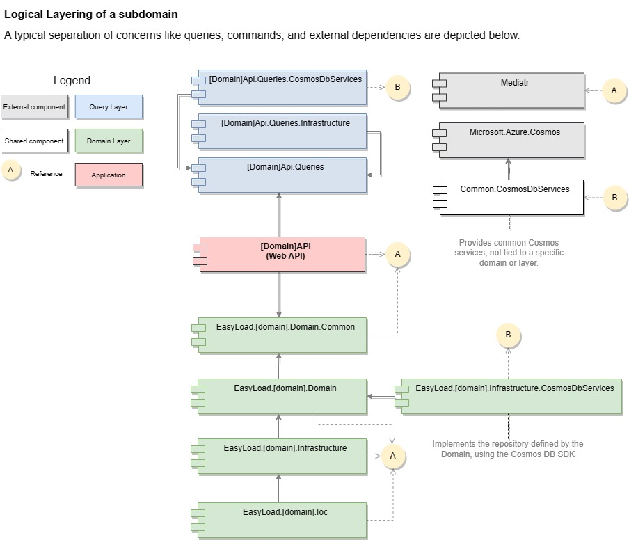

# Introduction

This is a ficticious, unfinished product.

The goal is to show how one can organize a solution, create highly cohesive components, and prepare the system to grow.
Many concepts were taken into consideration before deciding how to structure this sample solution:
 - Domain Driven Design
   -  Entities
   -  Value Objects
 - CQRS
   - Commands
   - Queries 
 - OAuth2
   - client authentication
 - OpenApi
 - Dependency Injection
 - NoSql
 - Micro Services
 - Unit Tests
 - Monorepo
 - etc...

# Repository Structure

## Root Folder
This is the structure you'll see once in the root folder. 
         
         |- EasyLoad.sln: A solution file containing all projects in this repo.
         |- Common: Cross-cutting concerns, shared libraries.
         |- Domain: Various subfolders representing all subdomains, and for every subdomain, the Applications that handle the specific subdomain.
            |- Loaders: Currently empty. Represents companies loading Trucks with their goods.
            |- Unloaders: Currently empty. Represents companies unloading the Trucks.
            |- Truckers: Partially implemented. Represents the business rules governing Truckers, whi are transporting goods from Loaders to Unloaders.

## Domain Folder

       [subdomain]
            |- Apps: Applications that use the current subdomain logic are stored here.
                |- Api: A RESTFul/Reactive API/SOAP API that indirectly exposes the current subdomain's logic to other client applications.
                |- EasyLoaders.[subdomain].Domain: Entities, Value Objects, Repository Interfaces, Domain Services. Cannot be directly referenced by applications.
                |- EasyLoaders.[subdomain].Domain.Common:  Commands, Business Exceptions, Enumerations, Value Objects, etc, that are specific to this subdomain, and are allowed to be referenced by applications, like an API.
                |- EasyLoaders.[subdomain].Domain.Infrastructure:  Command Handlers and Repositories implementations, and any other non-domain related service, like an integration with an FTP.
                |- EasyLoaders.[subdomain].Domain.Ioc:  All Dependency Injection and Options Pattern-related configurations, specific to the current subdomain. 

This folder also contains the test projects, when required. The pattern to name a test project is [Tested project name]Tests.

# Layering

